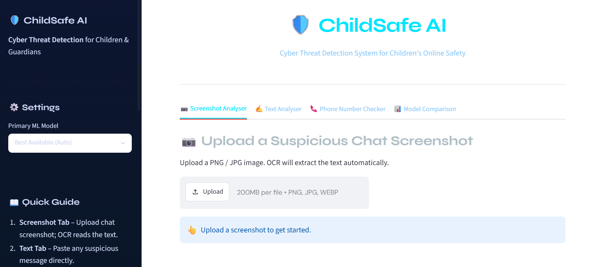
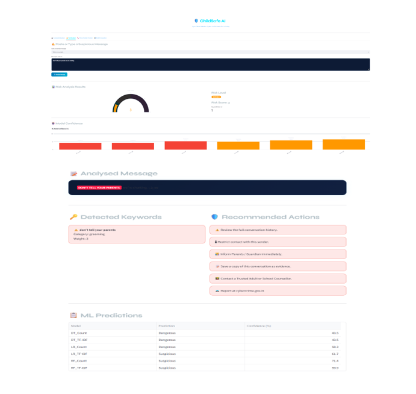
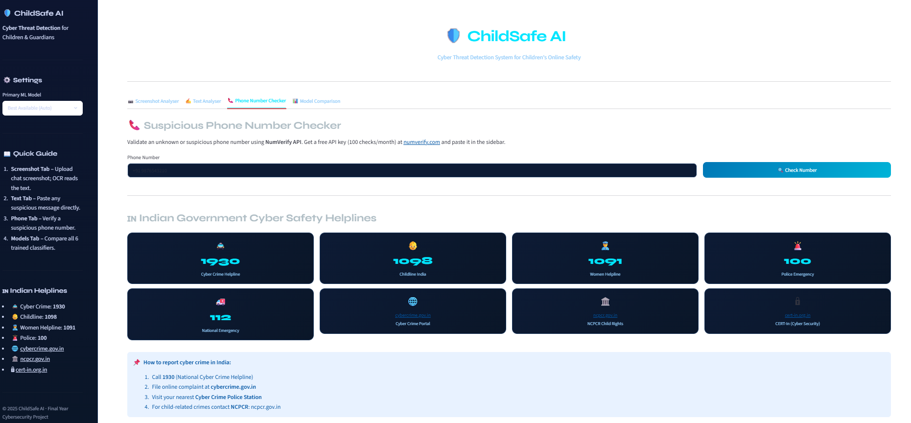

<div align="center">

# 🛡️ ChildSafe AI
### End-to-End Cyber Threat Detection Platform for Safer Digital Conversations


*Detecting cyberbullying, phishing, grooming, and malicious conversations — before they cause harm.*

</div>

---

## 🧠 About the Project

ChildSafe AI is a cyber threat detection platform built to identify harmful digital conversations — including **cyberbullying, phishing, online grooming, and malicious intent** — from both typed text and chat screenshots.

It combines **Natural Language Processing (NLP)**, **Optical Character Recognition (OCR)**, and an **ensemble of Machine Learning classifiers** to turn a raw conversation or screenshot into an interpretable risk score, making it useful for parents, moderators, and investigators alike.

Built during a Summer internship in **Cyber Security & AI** at the **Uttar Pradesh State Institute of Forensic Science (UPSIFS), Lucknow**.

---

## 📸 Demo
<div align="center">

### 🏠 Home Interface


<br><br>

### 📊 Threat Detection & Analysis


<br><br>

### ☎️ Suspicious Phone Number Checker


</div>
---

## ✨ Key Features

- 💬 Text-based threat classification — cyberbullying, phishing, grooming, and malicious intent
- 🖼️ Screenshot OCR analysis using Tesseract for image-based conversations
- 🗳️ Multi-model inference — Logistic Regression, Random Forest, and Decision Tree
- 📊 Risk scoring engine combining model outputs into an interpretable threat level
- ☎️ Phone number extraction & validation as part of phishing detection
- 🔤 TF-IDF / CountVectorizer based text vectorization
- 📈 Confusion-matrix driven model evaluation and tuning
- ⚡ Simple, interactive Streamlit dashboard for real-time analysis

---

## ⚙️ How It Works

```
Text / Screenshot Input → OCR Extraction (if image) → Text Preprocessing
      → TF-IDF / CountVectorizer Feature Extraction → Multi-Model Inference
          (Logistic Regression + Random Forest + Decision Tree)
              → Risk Scoring → Threat Category Output
```

---

## 🛠️ Tech Stack

| Category | Tools |
|---|---|
| Language | Python |
| Machine Learning | Scikit-learn (Logistic Regression, Random Forest, Decision Tree) |
| NLP | TF-IDF, CountVectorizer |
| OCR | Tesseract OCR |
| Web App / UI | Streamlit |
| Data | NumPy, Pandas |

---

## 📁 Project Structure

```
CHILDSAFE-AI/
│
├── childsafe_ai/       # Core application logic
│   ├── models/         # Trained ML models
│   ├── utils/          # OCR, preprocessing, feature extraction helpers
│   ├── data/            # Sample / training data
│   └── app.py           # Streamlit entry point
│
├── demo/                # Sample screenshots
├── requirements.txt
└── README.md
```

> Update this tree to match the actual folder contents in your repo.

---

## 🚀 Quick Start

```bash
# 1. Clone the repo
git clone https://github.com/ajiteshshuklaa/ChildSafe-AI.git
cd ChildSafe-AI/childsafe_ai

# 2. Install dependencies
pip install -r requirements.txt

# 3. Run the app
streamlit run app.py
```

> Requires [Tesseract OCR](https://github.com/tesseract-ocr/tesseract) installed and available on your system PATH.

---

## 📊 Dataset

Labelled conversation dataset covering:
- Threat categories (Cyberbullying / Phishing / Grooming / Malicious / Safe)
- Extracted text features (TF-IDF / CountVectorizer vectors)
- Risk-score annotations for evaluation

Used for training, validation, and confusion-matrix based model evaluation.

---

## 🤖 Models Used

| Model | Purpose |
|---|---|
| Logistic Regression | Baseline text threat classification |
| Random Forest | Ensemble-based classification for robustness |
| Decision Tree | Interpretable rule-based classification |

---

## 👨‍💻 Author

**Ajitesh Shukla** — AI & Cyber Security Enthusiast

[](https://www.linkedin.com/in/ajitesh-shukla-/)
[](https://github.com/ajiteshshuklaa)

---

## 📄 License

This project is currently unlicensed. Add a [LICENSE](LICENSE) file (e.g. MIT) if you plan to open it up for external contributions or reuse.
